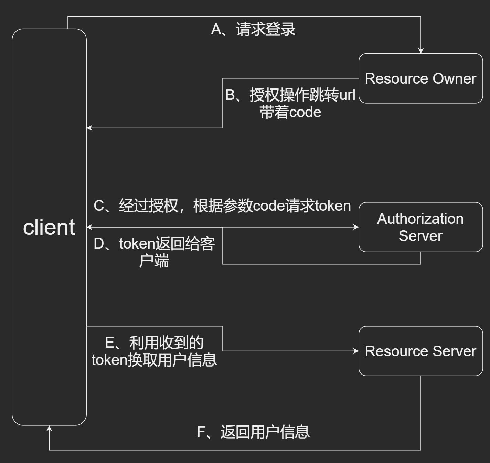

## 一、注册

​		**注意**：注册时要判断用户是否存在，若使用select查找判断，当用户量大时（假设1万人同时注册），一万个请求同时达到数据库，影响数据库性能，因此我们直接给字段设置唯一（使用unique设置唯一），如：

```python
class User(Base):
    id = models.AutoField(primary_key=True)
    username = models.CharField(max_length=100, unique=True)  #unique=True 允许唯一
    password = models.CharField(max_length=200)
    num = models.IntegerField(default=0)

    class Meta:
        db_table = "user"
```


## 二、登录

​		**PyJWT** 相比于 **drf** 更加灵活，可以在Flask\Behave等框架上使用，一般会用PyJWT生成token

​		我们使用钉钉机器人在群里发送验证码

​		钉钉机器人配置

​    工作群---->群设置---->智能群助手---->添加机器人---->自定义机器人---->进行设置（选择加签方式）

注：第一种是使用关键字，就是说你推送的消息里必须包含你创建机器人时定义的关键字，如果不包含就推送不了消息，第二种就是使用加密签名，第三种是定义几个ip源，非这些源的请求会被拒绝，综合来看还是第二种又安全又灵活。

​		创建成功后系统会分配一个webhook地址，这个地址在发送消息是会用到，下面是让机器人推送消息的方法：

```python
import time
import hmac
import hashlib
import base64
import urllib.parse

timestamp = str(round(time.time() * 1000))
secret = '自己的secret'  # 就是那个创建时灰色的只有一个重置按钮的，双击能复制
secret_enc = secret.encode('utf-8')
string_to_sign = '{}\n{}'.format(timestamp, secret)
string_to_sign_enc = string_to_sign.encode('utf-8')
hmac_code = hmac.new(secret_enc, string_to_sign_enc, digestmod=hashlib.sha256).digest()
sign = urllib.parse.quote(base64.b64encode(hmac_code))
# print(timestamp)
# print(sign)


import requests,json   #导入依赖库
headers={'Content-Type': 'application/json'}   #定义数据类型
webhook = '自己的webhook地址&timestamp='+timestamp+"&sign="+sign
#定义要发送的数据
#"at": {"atMobiles": "['"+ mobile + "']" 指定要发送给谁
data = {
    "msgtype": "text",
    "text": {"content": '雷霆嘎巴！'},  # 这里是要发送的信息（验证码）
    "isAtAll": True  # @全体
}
res = requests.post(webhook, data=json.dumps(data), headers=headers)   #发送post请求

print(res.text)
```

这次使用session来存放code验证码

```python
class DingView(APIView):
    def get(self, request):
        num = random.randint(100000, 999999)
        Ding(num)
        request.session = {
            'code': num
        }
        print(request.session['code'])
        return Response({
            'message': '获取验证码成功！',
            'code': 200,
            'session': request.session['code'],
        })
    
class LoginView(APIView):
    def post(self, request):
        print(request.data)
        username = request.data.get("username")
        password = request.data.get("password")
        code = request.data.get("code")
        # session_code = request.session.get("code")  # 一个坑，用postman可以获取，当用vue页面时获取不到
        session_code = request.data.get("sessions")
        print(session_code, '---')
        if not session_code:
            return Response({
                'message': "请获取验证码！",
                'code': 500,
            })
        user_obj = User.objects.filter(username=username).first()
        try:
            if user_obj and check_password(password, user_obj.password):
                payload = {
                    'exp': datetime.datetime.utcnow() + datetime.timedelta(hours=10),
                    'data': {
                        'user_id': user_obj.id,
                        'username': username,
                    }
                }
                token = jwt.encode(payload=payload, key=settings.SECRET_KEY)
                if int(code) == session_code:
                    return Response({
                        'message': '登录成功！',
                        'code': 200,
                        'token': token,
                        'username': user_obj.username,
                        'user_id': user_obj.id,
                    })
                return Response({
                    'message': '验证码错误，请重新输入！',
                    'code': 500
                })
            return Response({
                'message': '用户名或密码错误！',
                'code': 500,
            })
        except Exception as e:
            print(e)
            return Response({'Error': e})
```

**巨坑**：↑request.session.get("code")只能用postman获取，不能使用前端页面获取  

解决方法：session是基于cookie的所以，在使用时，需要在vue项目中的main.js里加上

```js
/*引入axios*/
import Axios from 'axios'
Vue.prototype.axios = Axios;

Axios.defaults.withCredentials = true;
```

当用到这个的时候，那么就会报一个跨域的错（目前还没调通）


## 三、三方登录

- ### 整体思路




- ### 使用HTTPS协议运行runserver

  django 默认的runserver使用的是http协议，如果需要https协议，需要以下3个库

```shell
django-extensions
django-werkzeug-debugger-runserver
pyOpenSSL

# 直接pip install安装  豆瓣镜像-i https://pypi.douban.com/simple
```

​	配置settings.py文件

```python
在INSTALLED_APPS下添加
INSTALLED_APPS = [
    ···
    'werkzeug_debugger_runserver',
	'django_extensions',
]
```

​	在终端使用命令以HTTPS的方式运行

```shell 
python manage.py runserver_plus --cert server.crt 0:8000
```

